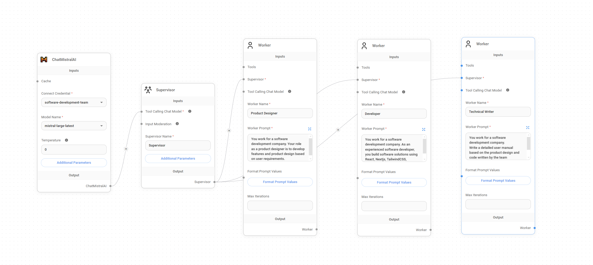

# Workflow Automation with Agents using Flowise

This project demonstrates a workflow automation system that utilizes different agents to perform various tasks, created using Flowise. The agents include roles such as Product Designer, Developer, and Technical Writer, each performing specific functions to streamline the workflow.

## Overview

In this system, agents are configured to work together to complete a software development cycle. Each agent has a distinct role and set of tasks, contributing to the overall process.

Below is a visual representation of the workflow:

### Key Components

- **ChatMistralAI**: Acts as the central AI model that processes inputs and coordinates with other agents.
- **Supervisor**: Manages the workflow by delegating tasks to the appropriate worker agents.
- **Worker Agents**: Includes roles such as Product Designer, Developer, and Technical Writer, each with specific prompts and tasks.

## Agents and Their Roles

### ChatMistralAI
The main AI component that handles input processing and communicates with the supervisor to manage the workflow.

### Supervisor
- **Role**: Oversees the entire workflow, ensures tasks are assigned correctly, and monitors the progress of worker agents.
- **Tasks**: Delegates tasks to the appropriate worker agents, moderates inputs, and ensures smooth operation.

### Worker Agents
Each worker agent has a specific role in the development process:

1. **Product Designer**
   - **Role**: Develops features and product designs based on user requirements.
   - **Prompt**: "You work for a software development company. Your role as a product designer is to develop features and product design based on user requirements."

2. **Developer**
   - **Role**: Builds software solutions using technologies like React, Next.js, and TailwindCSS.
   - **Prompt**: "You work for a software development company. As an experienced software developer, you build software solutions using React, Next.js, TailwindCSS."

3. **Technical Writer**
   - **Role**: Writes detailed user manuals based on the product design and code provided by the team.
   - **Prompt**: "You work for a software development company. Write a detailed user manual based on the product design and code written by the team."

## Features

- **Role-based workflow automation**: Each agent has a clearly defined role and tasks, ensuring efficient workflow management.
- **Customizable prompts and parameters**: Easily modify prompts and parameters to suit specific project needs.
- **Streamlined communication**: Effective coordination between agents to ensure smooth and efficient workflow execution.
